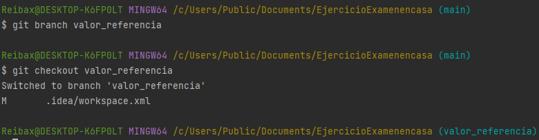

# Examen en casa
- Creación de un proyecto de IntelliJ con repositorio Git y código de ejemplo.

- Creamos y desarrollamos la rama valor_referencia

- 

- commit en la misma rama mejorando el codigo

-Mergenado rama con main

- -
-   

- pasando arrays

- mergeo de paso arrays con main 

- creando ramas comparando_objetos y comparando_string
